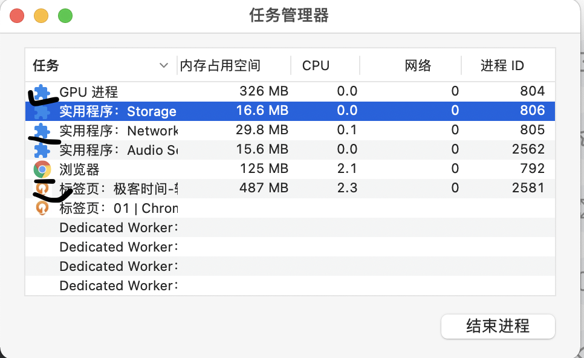
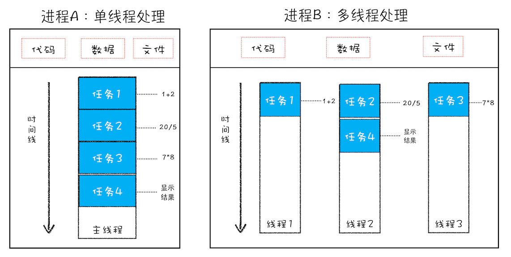
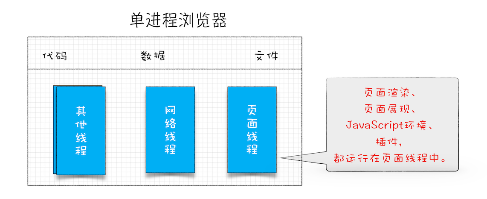
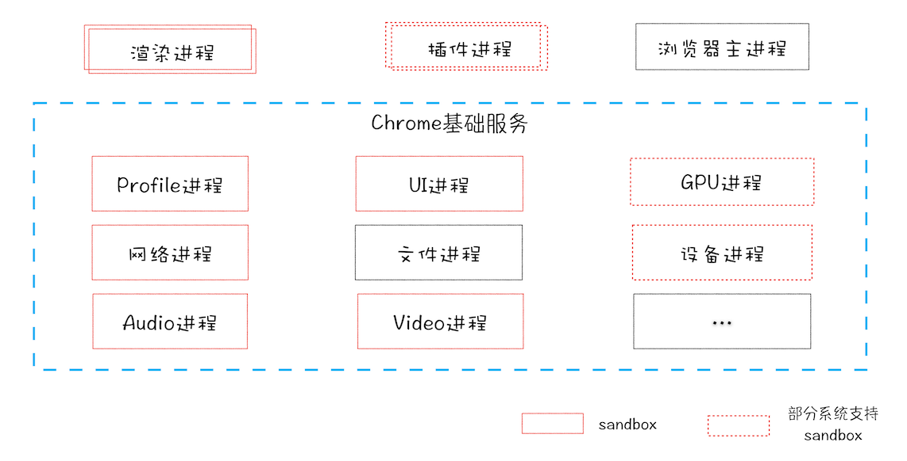

# 前言

无论是设计高性能web应用，还是优化现有web应用，你都需要去了解浏览器中的网络流程、页面渲染过程、Javascript执行流程、以及web安全理论。如何学：通过浏览器多进程架构的学习，可以把分散的知识点串起来，组成一张网，从更高的维度去理解web应用。

`首先来看一下，chrome 打开一个页面需要启动多少个进程，点击右上角的“选项”菜单->>更多工具->>任务管理器`，如下图：

可以看到，chrome启动了4个进程，其中还有Storage和Audio的进程，在chrome最初的多进程架构中，并不是这样，最新chrome的“面向服务架构”将这些服务单独作为一个进程，后续会一一介绍。

## 进程与线程

介绍进程与线程之前，先了解一下并行处理。

### 什么是并行处理:point_down

计算机中的并行处理就是一个时刻处理多个任务，比如计算如下三个表达式的值：

```
A = 1 + 2;
B = 20 / 5;
C = 7 * 8;
```

在编码时，可以把这个过程拆分为四个任务：

- **任务1** 计算 A=1+2
- **任务2** 计算 B=20/5
- **任务3** 计算 C=7*8
- **任务4** 显示最后的结果

单线程：按顺序执行这四个任务；
多线程：分两步，1-使用三个线程同时计算1-3，2-执行显示任务。

`通过对比发现，使用并行处理能大大提升性能`

## 线程 VS 进程

多线程可以**并行处理**任务，但是线程是不能单独存在的，它是由**进程**来**启动和管理**的。那什么又是进程呢？

**一个进程就是一个程序的运行实例**，详细解释就是，启动一个程序的时候，操作系统会为该程序创建一块内存，用来存放代码，运行中的数据和执行中的主线程，把这样的一个**运行环境**叫做**进程**。

对比图：


从图中可以看出，**线程是依附于进程的，而进程中使用多线程并行处理能提升运算效率**。

进程与线程有以下四个特点：

1. 进程中的任意一个线程出错，都会导致整个进程的崩溃；
2. 线程之间共享进程中的数据，如下图所示：
  
3. 当一个进程关闭后，操作系统会回收进程所占用的内存；

  > 当一个进程退出时，操作系统会回收该进程所申请的所有资源；即使其中任意线程因为操作不当导致内存泄漏，当进程退出时，这些内存也会被正确回收。
  >
4. 进程之间的内容互相隔离
  每个进程只能访问自己占有的数据，正因为进程之间的数据是严格隔离的，所以当一个进程崩溃或者挂起了，是不会影响其他进程的。如果进程之间需要进行通信，就需要用到**进程通信(IPC)**的机制了。

## 单进程浏览器时代

`**单进程浏览器指的是浏览器中所有的功能模块都运行在一个进程里**`
这些模块包括了：网络，插件，JavaScript运行环境，渲染引擎和页面等。在2007年以前，市面上的浏览器都是单进程的，直到chrome推出的多进程。


### 问题1: 不稳定

早期浏览器需要借助于**插件**来实现诸如 Web 视频、Web 游戏等各种强大的功能，但是插件是最容易出问题的模块，并且还运行在浏览器进程之中，所以一个插件的意外崩溃会引起整个浏览器的崩溃。除了插件之外，**渲染引擎模块**也是不稳定的，通常一些复杂的 JavaScript 代码就有可能引起渲染引擎模块的崩溃。和插件一样，渲染引擎的崩溃也会导致整个浏览器的崩溃。

### 问题2: 不流畅

从上图可以看出，所有页面渲染模块，JavaScript运行环境以及插件都是运行在同一个线程中，当其中一个出问题，都会整个程序的运行速度。
> 除了了上述脚本或者插件会让单进程浏览器变卡顿外，页面的内存泄漏也是单进程变慢的一个重要原因。通常浏览器的内核都是非常复杂的，运行一个复杂点的页面再关闭页面，会存在内存不能完全回收的情况，这样导致的问题是使用时间越长，内存占用越高，浏览器会变得越慢。

### 问题3：不安全

插件可以获取到系统的任意资源，这样会引发安全问题；
页面脚本可以通过浏览器漏洞来获取系统权限。

# 多进程浏览器时代

2008年 chrome 发布时的架构图：

   从图中可以看出：

   1. Chrome 页面是单独运行在渲染进程中；
   2. 插件 也是单独运行在插件进程中；
   3. 主进程负责下载资源，管理 IPC(inner-process communication)。

- 解决了不稳定问题：插件及页面渲染各自单独运行在独立进程中，崩溃时不会影响到浏览器和其他界面。
- 解决了不流畅问题：javascript 运行在渲染进程中，当 js 脚本阻塞了页面渲染，也只影响到当前页面的渲染，不会影响浏览器及其他页面；
- 对内存泄漏来说，当一个页面关闭时，整个进程的所占用的内存资源全部被回收了，也就不存在内存泄漏了。
- 解决安全问题：使用了**安全沙箱**，即使插件或者js脚本中存在恶意代码，也不会获取到系统权限。

## 目前多进程架构


这就和开头展示的chrome浏览器任务管理器的截图遥相呼应了。
`从图中可以看出，最新的 Chrome 浏览器包括：1 个浏览器（Browser）主进程、1 个 GPU 进程、1 个网络（NetWork）进程、多个渲染进程和多个插件进程。`

各个进程的功能：

- **浏览器主进程**：负责界面显示，用户交互，子进程管理，同时提供存储功能；
- **渲染进程**：核心任务是将 HTML、CSS 和 JavaScript 转换为用户可以与之交互的网页，排版引擎 Blink 和 JavaScript 引擎 V8 都是运行在该进程中，默认情况下，Chrome 会为每个 Tab 标签创建一个渲染进程。出于安全考虑，渲染进程都是运行在沙箱模式下。
- **GPU 进程**：其实，Chrome 刚开始发布的时候是没有 GPU 进程的。而 GPU 的使用初衷是为了实现 3D CSS 的效果，只是随后网页、Chrome 的 UI 界面都选择采用 GPU 来绘制，这使得 GPU 成为浏览器普遍的需求。最后，Chrome 在其多进程架构上也引入了 GPU 进程。
- **网络进程**：主要负责页面的网络资源加载，之前是作为一个模块运行在浏览器进程里面的，直至最近才独立出来，成为一个单独的进程。
- **插件进程**：主要是负责插件的运行，因插件易崩溃，所以需要通过插件进程来隔离，以保证插件进程崩溃不会对浏览器和页面造成影响。
  
`多进程优点：稳定，流畅和安全`

缺点：
`更高的资源占用。因为每个进程都会包含公共基础结构的副本（如 JavaScript 运行环境），这就意味着浏览器会消耗更多的内存资源）。`

`更复杂的体系结构：更复杂的体系架构。浏览器各模块之间耦合性高、扩展性差等问题，会导致现在的架构已经很难适应新的需求了。`

## 未来面向服务的架构

> 为了解决这些问题，在 2016 年，Chrome 官方团队使用“面向服务的架构”（Services Oriented Architecture，简称 SOA）的思想设计了新的 Chrome 架构。也就是说 Chrome 整体架构会朝向现代操作系统所采用的“面向服务的架构” 方向发展，原来的各种模块会被重构成独立的服务（Service），每个服务（Service）都可以在独立的进程中运行，访问服务（Service）必须使用定义好的接口，通过 IPC 来通信，从而构建一个更内聚、松耦合、易于维护和扩展的系统，更好实现 Chrome 简单、稳定、高速、安全的目标。

Chrome 最终要把 UI、数据库、文件、设备、网络等模块重构为基础服务，类似操作系统底层服务，下面是 Chrome“面向服务的架构”的进程模型图：


> Chrome 正在逐步构建 Chrome 基础服务（Chrome Foundation Service），如果你认为 Chrome 是“便携式操作系统”，那么 Chrome 基础服务便可以被视为该操作系统的“基础”系统服务层。同时 Chrome 还提供灵活的弹性架构，在强大性能设备上会以多进程的方式运行基础服务，但是如果在资源受限的设备上（如下图），Chrome 会将很多服务整合到一个进程中，从而节省内存占用。


🤔:

1. 回顾浏览器的进化路线，你认为推动浏览器发展的主要动力是什么？

> 互联网的高速发展，网络速度的提升，硬件设备性能的提升，web技术(如音视频，3d，web图形技术等)的发展，用户需求的增加，用户体验的重要性提升倒逼浏览器提高自身的运行性能及拓展自己的能力。

1. 即使是如今的多进程架构，我偶尔还会碰到一些由于单个页面卡死最终崩溃导致所有页面崩溃的情况，请问这是什么原因呢？

> 是这样的，通常情况下是一个页面使用一个进程，但是，有一种情况，叫"同一站点(same-site)"，具体地讲，我们将“同一站点”定义为根域名（例如，geekbang.org）加上协议（例如，https:// 或者http://），还包含了该根域名下的所有子域名和不同的端口，比如下面这三个：

> <https://time.geekbang.org>
<https://www.geekbang.org>
<https://www.geekbang.org:8080>
都是属于同一站点，因为它们的协议都是https，而根域名也都是geekbang.org。你也许了解同源策略，但是同一站点和同源策略还是存在一些不同地方，在这里你需要了解它们不是同一件事就行了。

> Chrome的默认策略是，每个标签对应一个渲染进程。但是如果从一个页面打开了新页面，而新页面和当前页面属于同一站点时，那么新页面会复用父页面的渲染进程。官方把这个默认策略叫process-per-site-instance。

> 直白的讲，就是如果几个页面符合同一站点，那么他们将被分配到一个渲染进程里面去。

> 所以，这种情况下，一个页面崩溃了，会导致同一站点的页面同时崩溃，因为他们使用了同一个渲染进程。

> 为什么要让他们跑在一个进程里面呢？

> 因为在一个渲染进程里面，他们就会共享JS的执行环境，也就是说A页面可以直接在B页面中执行脚本。因为是同一家的站点，所以是有这个需求的。
